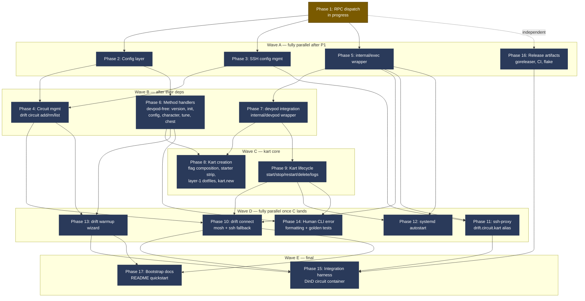

# drift — parallel execution plan

Companion to [TODO.md](./TODO.md). TODO.md is the linear punch list; this file
groups phases 2–17 into **waves that can run concurrently** so multiple agents
(or one agent juggling worktrees) can speed-run to MVP.

Phase 0 is done. Phase 1 (RPC dispatch) is in flight. Everything below assumes
Phase 1 has landed — it unblocks the dispatcher, the drift-side `Call` helper,
and the shared method-name constants that almost every later phase imports.

---

## Dependency graph



---

## Critical path

The longest dependency chain — anything not on this path has slack and should
be scheduled around it:

```
P1 → P2 → P6 → P8 → (P10 ∥ P13) → P15 → P17
              ↑
          P5 → P7 also feeds P8 (same depth, also critical)
```

Branches off the critical path that finish faster than P8 can land "for free":
- **P3 → P4 → P10/P13** — SSH config + circuit CLI. Mostly file/string
  manipulation, no external processes.
- **P11, P12, P14** — small, narrow scope; pick up whenever an agent is idle.
- **P16** — pure infra (goreleaser, CI, flake). Can start day one and finish
  before any handler code lands.

---

## Wave-by-wave breakdown

### Wave A — start the moment Phase 1 merges (4 parallel tracks)

| phase | scope | why it parallelizes | est. blast radius |
|-------|-------|---------------------|-------------------|
| **P2** Config | YAML loader, client + server schemas, `lakitu init` | new package, no overlap with sshconf or exec | `internal/config/`, `garage/config.yaml` shape |
| **P3** SSH config | parser/writer for `~/.config/drift/ssh_config`, `Include` line, wildcard block | new package, touches no Go shared by others | `internal/sshconf/` |
| **P5** Exec wrapper | `exec.CommandContext` + `Cancel` + `WaitDelay` helper | new package, used by everyone later | `internal/exec/` |
| **P16** Release infra | `.goreleaser.yaml`, CI workflow, `flake.nix` | doesn't touch Go source | `.github/`, `flake.nix`, top-level configs |

**Coordination risk:** none. Four independent packages, four independent commits.

### Wave B — kicks off as Wave A finishes individual tracks

| phase | unblocked by | scope |
|-------|--------------|-------|
| **P4** Circuit mgmt | P2 + P3 | `drift circuit add/rm/list`, kart-name validator, version probe |
| **P6** Method handlers (devpod-free) | P1 + P2 | `server.version`, `server.init`, `config.*`, `character.*`, `tune.*`, `chest.*` |
| **P7** devpod wrapper | P5 | `internal/devpod` typed shim — `Up/Stop/Delete/Status/SSH/List/Logs/InstallDotfiles` |

P6 and P7 are independent of each other — P6 owns file-backed handlers, P7 owns
the devpod CLI shim. Run them concurrently.

### Wave C — kart core

| phase | unblocked by | scope |
|-------|--------------|-------|
| **P8** Kart creation | P6 + P7 | flag composition, starter history strip, layer-1 dotfiles, `kart.new`, interrupt cleanup |
| **P9** Kart lifecycle | P7 (P6 dispatcher already wired) | `kart.start/stop/restart/delete/logs` |

P8 and P9 mostly touch the same `internal/kart/` area — schedule sequentially
**unless** split cleanly: P8 owns `new.go` + flag resolver, P9 owns
`lifecycle.go`. If split, run in parallel.

### Wave D — fully parallel once C lands (5 tracks)

All five depend on different subsets of earlier waves and don't touch each
other's files:

- **P10** drift connect — `cmd/drift` + `internal/connect` (mosh detect, ssh fallback)
- **P11** ssh-proxy — `cmd/drift` (`drift ssh-proxy` subcommand)
- **P12** systemd autostart — `internal/systemd` + unit file
- **P13** warmup wizard — `cmd/drift` + `internal/warmup`
- **P14** error formatting — `internal/cli/*` stderr formatter + golden tests

Coordination risk: P10, P11, P13 all add subcommands to `cli/drift/drift.go`.
Expect Kong-struct merge conflicts — assign one agent the integration of the
final command tree.

### Wave E — gated on most of MVP

- **P15** Integration harness — needs P10 + P11 + P13 working end-to-end and P16's binary builds
- **P17** Docs — needs the user-facing surface stable (P10, P13)

---

## Suggested agent allocation

If you have **3 parallel agents** post-Phase-1:

1. **Agent infra** — P5 → P7 → P9 (devpod track + lifecycle)
2. **Agent state** — P2 → P6 → P8 (config + handlers + kart create)
3. **Agent edges** — P3 → P4 → P11 + P10 (ssh-config + circuit + connect)

Then collapse to one agent for the cross-cutting waves: P12, P13, P14, P15, P17.
P16 can be a background agent from day one.

If you have **2 agents**:

1. **Agent core** — P2 → P5 → P6 → P7 → P8 → P9 (the critical path, in order)
2. **Agent edges** — P3 → P4 → P10 → P11 → P13 → P14 (everything that hangs off the side), with P16 sprinkled in

---

## Hard sequencing rules (don't violate)

- **Nothing handler-side starts before P1** — the dispatcher contract defines
  the function signature every handler implements.
- **P7 must land before P8/P9** — `internal/devpod` is the only legitimate
  caller of the devpod CLI. Don't shell out to devpod from handlers directly.
- **P6's `chest.*` must land before P13** — warmup's "stage a PAT" step calls
  `chest.set` over RPC.
- **P3's wildcard block must land before P11** — `drift ssh-proxy` is invoked
  by the ProxyCommand stanza P3 writes.
- **P14 needs at least P6 merged** — golden tests need real error sources.

---

## Things that look parallel but aren't

- **P8 and P9 sharing `internal/kart/`** — if both agents touch `kart.go` they
  will conflict. Pre-split files or sequence them.
- **P10, P11, P13 all editing `cli/drift/drift.go`** — Kong struct conflicts.
  Land them on separate branches and merge serially.
- **P15 before MVP UX is stable** — the harness scripts assume final command
  names; landing it early means rewriting the scripts.
